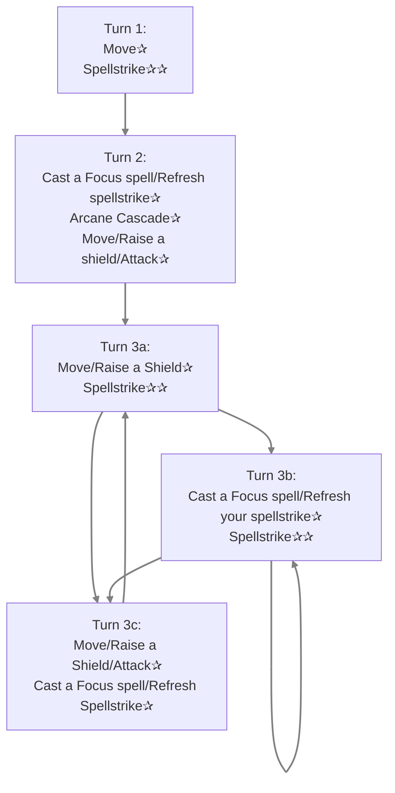

[[Xiat]] Basic Rotation:

Explained:   
Turn 1: Move+Spellstrike.  
Turn 2: Refresh Spellstrike, enter Arcane Cascade, move/attack  
Alternate between 3A and 3C.  
You can fit in 3B in between when you do not need to move/raise a shield.  
Remember: do you not need to raise a shield when you cast your focus spell.  